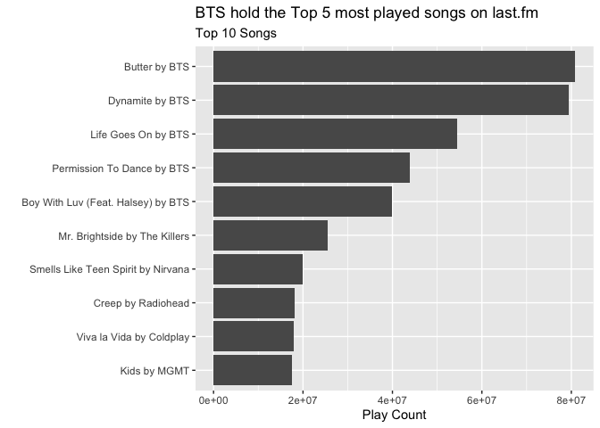

<!-- README.md is generated from README.Rmd. Please edit that file -->

# lastfmr

<!-- badges: start -->

[](https://github.com/bkkkk/lastfmr/actions)
<!-- badges: end -->

The goal of LastFMr is to simplify the work of interacting with the
last.fm API to get information about your favourite artists, albums, and
collecting scrobbles in a tidy format. Pagination is taken care of for
you and the data is organized with sensible column names and formatting.

## Installation

You can install the development version of lastfmr from
[GitHub](https://github.com/) with:

``` r
devtools::install_github("bkkkk/lastfmr")
```

## Basic usage

``` r
library(lastfmr)
library(tidyverse)
#> ── Attaching packages ─────────────────────────────────────── tidyverse 1.3.1 ──
#> ✓ ggplot2 3.3.5     ✓ purrr   0.3.4
#> ✓ tibble  3.1.6     ✓ dplyr   1.0.7
#> ✓ tidyr   1.1.4     ✓ stringr 1.4.0
#> ✓ readr   2.1.0     ✓ forcats 0.5.1
#> ── Conflicts ────────────────────────────────────────── tidyverse_conflicts() ──
#> x dplyr::filter() masks stats::filter()
#> x dplyr::lag()    masks stats::lag()
library(glue)
library(ggplot2)

lastfmr::chart_get_top_tracks(.n_pages = 10) %>%
  mutate(
    label = glue::glue("{name} by {artist}")
  ) %>%
  top_n(10, playcount) %>%
  ggplot(aes(reorder(label, playcount), playcount)) + geom_col() +
  coord_flip() + labs(
    y = "Play Count", x = "", title = "BTS hold the Top 5 most played songs on last.fm",
    subtitle = "Top 10 Songs"
  )
#> 
#> Using limit of 10 pages, starting from 1
```



The package provides functions for each of the endpoints and a generic
API function. For each of the endpoints there are 2 functions:

-   A “raw” function that a `lastfm_api` object which contains the
    concatenate result as well as additional information on the request
    and response. The results here use the raw column names from the
    last.fm API, and nested data.
-   A “tidy” function that returns a concatenated `tibble` with more
    sensible column names and flattened nested structures.

The function names are mapped directly from the endpoint name.

Below is a summary of endpoint support:

| Endpoint             | Raw                | Tidy               |
|----------------------|--------------------|--------------------|
| album.getInfo        | :heavy_check_mark: | :x:                |
| album.search         | :heavy_check_mark: | :x:                |
| chart.getTopArtists  | :heavy_check_mark: | :heavy_check_mark: |
| chart.getTopTags     | :heavy_check_mark: | :heavy_check_mark: |
| chart.getTopTracks   | :heavy_check_mark: | :heavy_check_mark: |
| track.search         | :heavy_check_mark: | :x:                |
| track.getInfo        | :heavy_check_mark: | :x:                |
| track.getSimilar     | :heavy_check_mark: | :x:                |
| user.getRecentTracks | :heavy_check_mark: | :heavy_check_mark: |
| user.getTopAlbums    | :heavy_check_mark: | :heavy_check_mark: |
| user.getTopArtists   | :heavy_check_mark: | :heavy_check_mark: |
| user.getTopTracks    | :heavy_check_mark: | :x:                |
| user.getFriends      | :heavy_check_mark: | :x:                |
| user.getInfo         | :heavy_check_mark: | :x:                |
| user.getLovedTracks  | :heavy_check_mark: | :x:                |
| user.getPersonalTags | :heavy_check_mark: | :x:                |
| user.getTopTags      | :heavy_check_mark: | :x:                |
| artist.getInfo       | :heavy_check_mark: | :x:                |
| artist.getSimilar    | :heavy_check_mark: | :x:                |
| artist.getTags       | :heavy_check_mark: | :x:                |
| artist.getTopAlbums  | :heavy_check_mark: | :x:                |
| artist.getTopTracks  | :heavy_check_mark: | :x:                |
| artist.search        | :heavy_check_mark: | :x:                |
